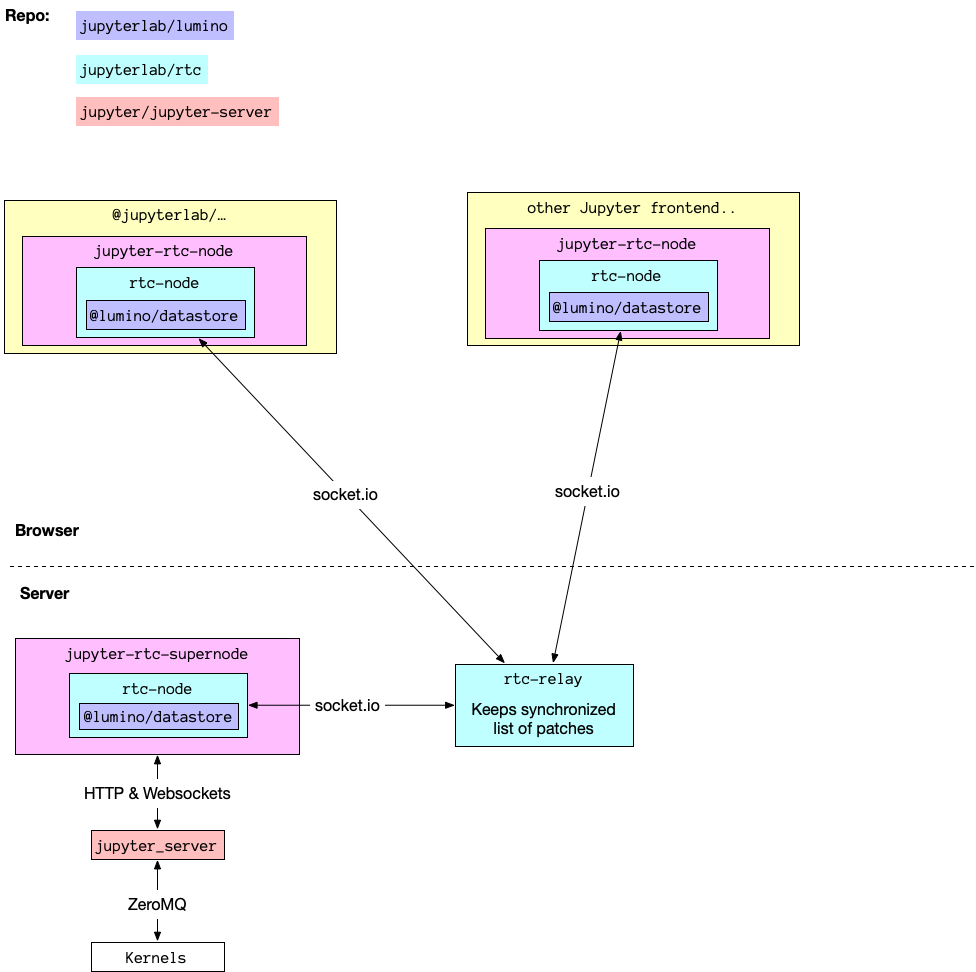

# Design

## Goals

The goal of this repo is to prototype a data model to support simultanious distributed
editing in Jupyter.

Fundamentally, it's about taking the **existing** concepts[1](#f1) provided by Jupyter server and creating a real time data model on top of them.

This would help provide a Google docs like editing experience in Jupyter editors by
allowing multiple simultanious users to edit a document at once.

It would do this by moving much of the state to be shared on the server as well,
which would also help address some other long running issues with Jupyter, around
preserving outputs even after you close your browser and dealing with race conditions
around kernel management.

This will happen in a number of different layers, added to this monorepo:

1. Base: CRDT implementation, lumino and/or other JS implementations
2. Middle: Friendly real time datastore using this with React integration
3. Higher level/Jupyter: Support for editing all data in Jupyter server
4. Jupyter clients: JupyterLab integration, spyder integration, nteract integration (examples)

## Non Goals

There are also a number of other ways to improve collaboration in Jupyter which this repo is not meant to address, at least initially.

It is not meant to be able to synchronize notebooks or work between Jupyter servers
runnning on multiple machines.

It also doesn't overlap with JupyterHub in that JupyterHub is about spawning multiple instances and this is about providing one instance for collaborative purposes.

It also isn't abot providing a concepts of Teams, Projects, Groups, etc. These are definately useful to have in a collaborative environment but for the initial work here we are assuming the same permisionless structure of a regular Jupyter server.

It's also often useful to share what environment you are in with your notebook, to make it more reproducible. This isn't about that kidn of collaboration either.

## User Stories

*During our first meeting we collected a few different user stories around this. Feel free to add to these if there are other points that should be considered.*

Once you have multiple users editing the same notebook, one fundemantal question is if each user has their own kernel or not. In some ways, it's more intuitive if they have the same because then you can re-use state between kernels easily and the normal model is to have one kernel per notebook. However, it is also then easy to clobber each others work. The simpler model to implement is one kernel per notebook, but it might be worth thinking about how to support the other as well.

So far, we have been focusing on the multiple users, single server issue, but there is also the inverse, multiple servers, single user problem. In this context, you might have a variety of computational resources available to you in different platforms and have to switch between them. So it might be worth thinking about how real time data model could enable connecting to multiple servers at once or easily switching between them.

Once you start sharing notebooks, you often don't want everyone to have all the same access. At the most fine grained, you could want POSIX style permissions for each cell in a notebook.

Also once you are collaborating you will need other side channels, like a chat, to keep in sync and coordinate outside of the document.

There is also a recent paper on this subject we should look at[1](#f2).

## Footnotes

[1]: Jupyter server specifications [↩](#a1)

- https://jupyter-client.readthedocs.io/en/stable/messaging.html
- http://petstore.swagger.io/?url=https://raw.githubusercontent.com/jupyter/notebook/master/notebook/services/api/api.yaml#/contents/post_api_contents__path_
- https://github.com/jupyter/jupyter/wiki/Jupyter-Notebook-Server-API

[2]: ["How Data Scientists Use Computational Notebooks for Real-Time Collaboration"](https://dl.acm.org/doi/10.1145/3359141) [presentation](https://ipitweb.files.wordpress.com/2019/06/wang_ipit-1.pdf) [↩](#a2)

