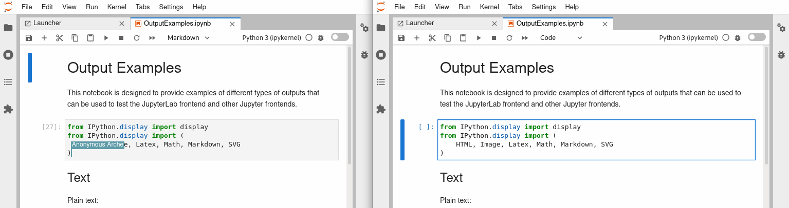

# Jupyter Real-Time Collaboration

[](https://github.com/jupyterlab/jupyter_collaboration/actions?query=branch%3Amain++)[](https://mybinder.org/v2/gh/jupyterlab/jupyter_collaboration/main)[](https://pypi.org/project/jupyter-collaboration)[](https://www.npmjs.com/package/@jupyter/collaboration-extension)

JupyterLab Real-Time Collaboration is a Jupyter Server Extension and JupyterLab extensions providing support for [Y documents](https://github.com/jupyter-server/jupyter_ydoc) and adding collaboration UI elements in JupyterLab.



## Installation and Basic usage

To install the latest release locally, make sure you have
[pip installed](https://pip.readthedocs.io/en/stable/installing/) and run:

```bash
pip install jupyter-collaboration
```

Or using ``conda``/``mamba``:

```bash
conda install -c conda-forge jupyter-collaboration
```

### Testing

See [CONTRIBUTING](./docs/source/developer/contributing.rst#running-tests).

## Contributing

If you are interested in contributing to the project, see [CONTRIBUTING](./docs/source/developer/contributing.rst).
