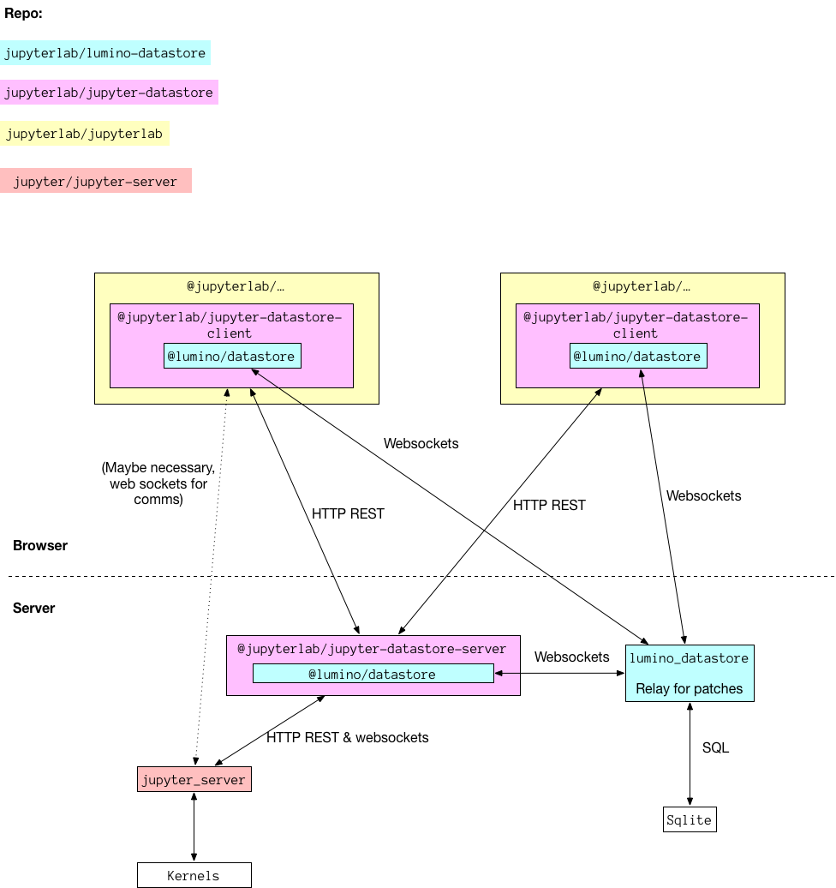

# JupyterLab Real Time Collaboration Plan!

## Comparison

Our current approach is to handle all communication on the clients. Alternatively,
here we propse having a server side datastore peer that handles keeping the models
up to date from the Jupyter server. It expose REST API endpoints to trigger
actions on the server, that are similar to the existing kernel endpoints, except
instead of returning the state they update the RTC models. They also expose many
of the kernel websocket methods as REST calls.

## Why?

- Reduce complexity on the clients.
- Works with existing infrastructure, i.e. Jupyter Server; doesn't disrupt old way to interact with server (can be run side-by-side).
- Single source of truth datastore on the server.
- Similar REST API to existing Jupyter Server REST API — less work for clients to switch to RTC.



- [ ] `jupyterlab/jupyter-datastore` API spec
  - [x] kernelspecs
  - [x] status
  - [x] terminals
  - [x] kernels
  - [x] sessions
  - [x] contents
  - [ ] config (Maybe we dont need this?)
  - [ ] Rewrite to clone existing API more closely
  - [ ] Add REST endpoints for execution with cell ID
  - [ ] Add a table for kernel executions (for consoles)
  - [ ] Deal with `request_input`, either in websockets or CRDT.
  - [ ] Spec out websockets for comms
- [ ] `jupyterlab/lumino-datastore` API spec
  - [ ] Create API spec based on Vidar's work
- [ ] Look into ORM on top of tables, using Ian's work
- [ ] Think about undo/redo behavior!
- [ ] Think about users and permissioning!

## `jupyterlab/lumino-datastore`

Includes client and server side components for synchronized CRDTs in the browser.

## `jupyterlab/jupyter-datastore`

The Jupyter Datastore package gives you an up to date data model of the Jupyter Server data structures in your browser. It also provides an interface to take actions on the Jupyter Server.

It is meant to be a building block for any Jupyter web UIs.

Goals:

- Save notebook outputs even when client is closed
- Add undo/redo
- Sync models between browser windows

RTC models in [`./spec.ts`](./spec.ts)

## API spec in [`main.py`](./main.py), translated to OpenAPI spec in [`spec.json`](./spec.json) which will be implemented in Node.

https://jupyter-client.readthedocs.io/en/stable/messaging.html

http://petstore.swagger.io/?url=https://raw.githubusercontent.com/jupyter/notebook/master/notebook/services/api/api.yaml#/contents/post_api_contents__path_

https://github.com/jupyter/jupyter/wiki/Jupyter-Notebook-Server-API

Generating spec:

```bash
python main.py > spec.json
```
