# Code Architecture

## Current Implementation

Jupyter Collaboration consists of several Python packages and frontend extensions:

- **jupyter_server_ydoc**:
  A Jupyter Server extension providing core collaborative models. It manages YDocument data structures tied to notebook files and exposes WebSocket endpoints for real-time updates. It integrates CRDTs into Jupyter’s file management and kernel system.

- **jupyter_collaboration**:
  A meta-package that bundles the backend (`jupyter_server_ydoc`) and frontend (JupyterLab and Notebook 7 UI extensions). It connects the collaborative frontend UX (status badges, shared cursors, etc.) with the backend.

### Key dependencies:

- **pycrdt-websocket**:
  WebSocket provider library used by the collaboration layer. It runs an async WebSocket server that synchronizes pycrdt documents by managing CRDT updates between clients and the shared server YDoc.

- **pycrdt-store**:
  Persistence layer for CRDT documents. Uses an SQLite-backed store (`.jupyter_ystore.db`) by default to checkpoint document history. Enables autosave and document state recovery after restarts or offline periods.

## Early attempts

Prior to the current implementation based on [Yjs](https://docs.yjs.dev/), other attempts using
different technologies where tried:

- Attempt based on [Automerge](https://automerge.org/). The code has been archived in that [branch](https://github.com/jupyterlab/jupyter_collaboration/tree/automerge). You can
  access the [documentation there](https://jupyterlab-realtime-collaboration.readthedocs.io/en/automerge/).
