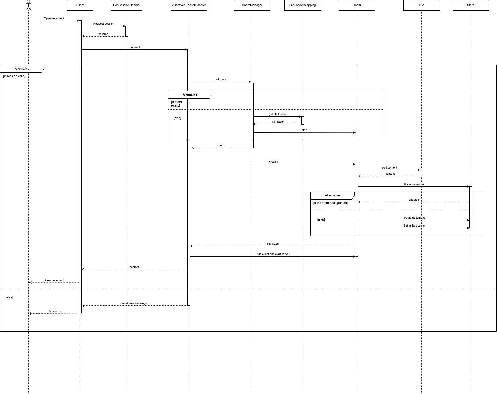
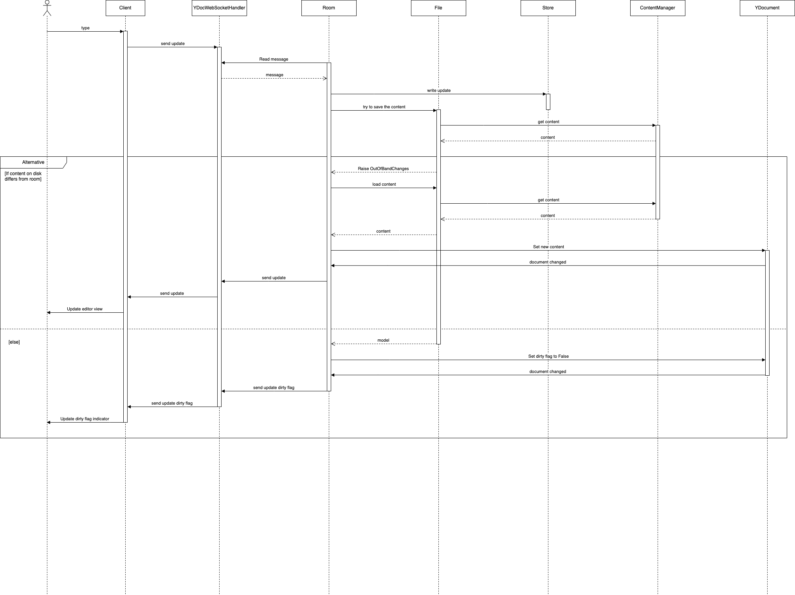
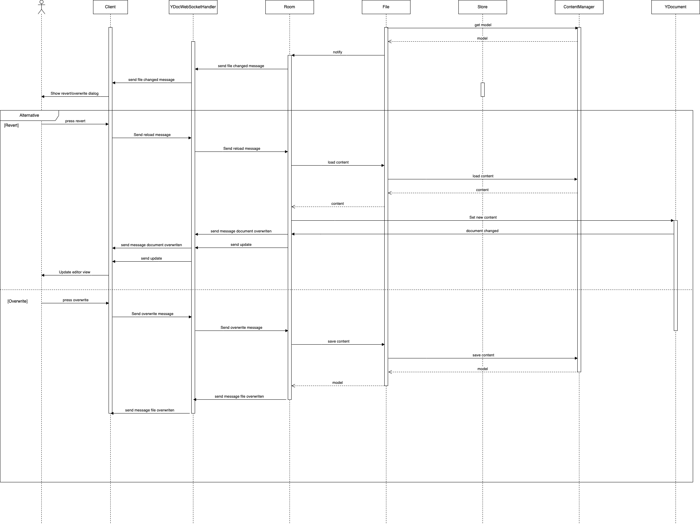

# Code Architecture

## Current implementation

COMING...

### Opening a document

### Autosave

### Conflict

## Early attempts

Prior to the current implementation based on [Yjs](https://docs.yjs.dev/), other attempts using
different technologies where tried:

- Attempt based on [Automerge](https://automerge.org/). The code has been archived in that [branch](https://github.com/jupyterlab/jupyter_collaboration/tree/automerge). You can
  access the [documentation there](https://jupyterlab-realtime-collaboration.readthedocs.io/en/automerge/).
