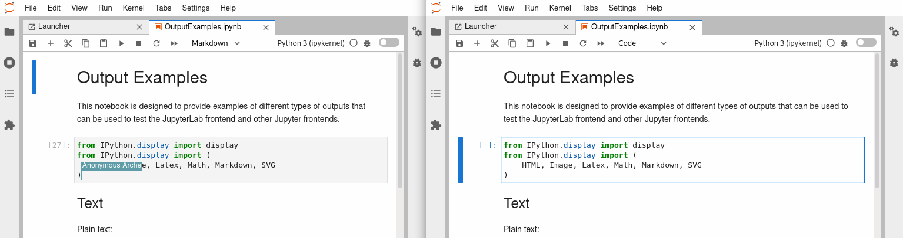

<!--
jupyter-ydoc documentation master file, created by
sphinx-quickstart on Wed Nov 23 12:45:39 2022.
You can adapt this file completely to your liking, but it should at least
contain the root `toctree` directive.
-->

# Welcome to JupyterLab Real-Time collaboration documentation!


From JupyterLab v4, file documents and notebooks have collaborative
editing using the [Yjs shared editing framework](https://github.com/yjs/yjs).
Editors are not collaborative by default; to activate it, install the extension
`jupyter_collaboration`.

Installation using mamba/conda:

```sh
mamba install -c conda-forge jupyter-collaboration
```

Installation using pip:

```sh
pip install jupyter-collaboration
```

The new collaborative editing feature enables collaboration in real-time
between multiple clients without user roles. When sharing the URL of a
document to other users, they will have access to the same environment you
are working on (they can e.g. write and execute the cells of a notebook).

Moreover, you can see the cursors from other users with an anonymous
username, a username that will disappear in a few seconds to make room
for what is essential, the document's content.



A nice improvement from Real Time Collaboration (RTC) is that you don't need to worry
about saving a document anymore. It is automatically taken care of: each change made by
any user to a document is saved after one second by default. You can see it with the dirty indicator
being set after a change, and cleared after saving.

If a file changes outside the shared session, for example through a third-party editor or
a Git branch switch, each user can choose independently to:

- **Open original file**: replace the current shared session with the disk version.
- **Save As…**: enter a new filename, save the current shared content there, and continue
  with this session.
- **Close tab**: close the current shared document.

Something you need to be aware of is that not all editors in JupyterLab support RTC
synchronization. Additionally, opening the same underlying document using different editor
types currently results in a different type of synchronization.
For example, in JupyterLab, you can open a Notebook using the Notebook
editor or a plain text editor, the so-called Editor. Those editors are
not synchronized through RTC because, under the hood, they use a different model to
represent the document's content, what we call `DocumentModel`. If you
modify and save a Notebook with one editor, the other session detects an external change
and prompts its users to choose how to proceed as described above.

Edits within the same collaborative session synchronize automatically. External changes
are handled separately so they cannot silently replace the content collaborators are viewing.

Sharing Notebooks
-----------------

To share a notebook with collaborators:

1. Click the **Share** button in the top-right corner
2. Check "Include token in URL" if sharing with non-authenticated users
3. Copy the generated URL and send it to your collaborators

Collaborators will have full access to your JupyterLab environment, including the ability to edit and execute cells.

> **Note**: For running a public server, refer to the [Jupyter Server documentation](https://jupyter-server.readthedocs.io/en/latest/operators/public-server.html#running-a-public-notebook-server).


```{toctree}
:maxdepth: 1
:caption: Contents

configuration
developer/contributing
changelog
```
