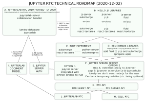

# Deliverables 



A. JupyterLab RTC 20219-2020
B. Hello JS Libraries
C. Rust Experiment
D. Benchmark Libraries
E. Jupyter Server Auth
F. Jupyter Server Service
G. RTC API
H. Cell RTC
I. JupyterLab Document Model
J. JupyterLab RTC

<!--
```{eval-rst}
.. mermaid::

    gantt
    dateFormat  YYYY-MM-DD
    title Architecture Definition

    section Definition
    Define Use Cases                       :active,  d1, 2020-10-05, 15d
    Define Sequences Diagrams              :         d2, after d1, 15d
```
-->
